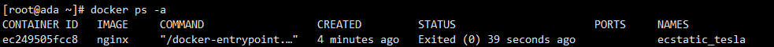

# 1. docker安装

官网安装流程：

https://docs.docker.com/engine/install/centos/

```shell
# 移除旧版本docker
sudo yum remove docker \
                  docker-client \
                  docker-client-latest \
                  docker-common \
                  docker-latest \
                  docker-latest-logrotate \
                  docker-logrotate \
                  docker-engine

# 配置docker yum源。这里修改为对应的阿里云源，更快
sudo yum install -y yum-utils
sudo yum-config-manager \
--add-repo \
http://mirrors.aliyun.com/docker-ce/linux/centos/docker-ce.repo


# 安装 最新 docker
sudo yum install -y docker-ce docker-ce-cli containerd.io docker-buildx-plugin docker-compose-plugin
# 启动docker
sudo systemctl start docker
# 可以使用docker命令，展示镜像
docker ps

# 启动& 开机启动docker； enable + start 二合一
systemctl enable docker --now

# 配置加速，默认去dockerhub的，可以配置国内镜像加速
sudo mkdir -p /etc/docker
sudo tee /etc/docker/daemon.json <<EOF
{
    "registry-mirrors": [
        "https://hub.uuuadc.top",
        "https://docker.anyhub.us.kg",
        "https://dockerhub.jobcher.com",
        "https://dockerhub.icu",
        "https://docker.ckyl.me",
        "https://docker.awsl9527.cn"
    ]
}
EOF

# 通知 systemd 重新加载其配置文件的命令
sudo systemctl daemon-reload
# 重启docker应用更改
sudo systemctl restart docker
```

dcoker-ce 就是docker引擎

docker-ce-cli 引擎的命令行程序

containerd.io 运行时环境

docker-buildx-plugin 构建镜像工具

docker-compose-plugin 批量工具


# 2. 常见命令
## 2.1 下载镜像

相关命令

```shell
docker search nginx #检索镜像
docker pull nginx#下载镜像
docker images #查看本地镜像列表
docker rmi #删除镜像
```

docker search nginx 


name为镜像名称，description为描述，stars为镜像的star数目，offical为是否官方

docker pull nginx


docker images(repository镜像标签 tag 镜像版本 image id 镜像id)


```
镜像名其实完成名称格式为
镜像名：标签(版本)
下载1.26版本为
docker pull nginx:1.26.0
```

docker rmi nginx:1.26.0

记得加上完整名字

## 2.2 启动容器

### 启动命令

```
docker run nginx #这里会阻塞命令行，后台启动在下文
```


换一个窗口用

```
docker ps
CONTAINER ID 应用id
IMAGE 镜像名称
COMMAND 启动命令
CREATED 启动时间
STATUS 启动多长 up代表成功
PORTS 占用端口
NAMES 随机名
```


在原本窗口停ctrl+c停止后，会发现docker ps不会显示有容器启动

如果用

```shell
docker ps -a
会显示所有容器，包括停止的
```



### 重新启动

```shell
docker start ec2 #使用容器id重新启动，可以只使用前几位id，用来与别的容器区分即可，就会发现重新启动起来了
docker start ecstatic_tesla #也可以使用容器名
```

### 停止容器

```shell
docker stop ecstatic_tesla #也可以使用容器名
```

### 重启

```shell
docker restart (id或者应用名)
```

### 查看状态

```shell
docker stats ec2 #用容器名也可以，以下同上
#显示也是动态变化的，跟top命令差不多
```


### 查看容器日志

```shell
docker logs ec2
```

### 删除容器

```shell
docker rm ec2 #运行中的容器会提示你需要先停止，或者用 force remove 就是加上 -f 命令行参数
```


### 后台启动

```shell
docker run -d --name mynginx nginx
#-d指定后台启动
#mynginx指定名字，要不然会随机名字
```

这时候虽然用docker ps查看虽然还是占用80端口，但是暂时还是不能访问，占用的是容器系统的80端口

### 端口映射

端口映射，宿主机的端口都是独立冲突的，容器的端口可以重复，因为互相不影响

```shell
#可以先将之前的容器删除掉，启动重名会提示冲突
docker run -d --name mynginx -p 80:80 nginx 
#这里-p指定端口映射，前面的是宿主机，后面的是容器端口
启动后docker ps查看
这里ports展示了对应的映射关系，如果是云主机，记得在安全规则开启80端口
```


### 进入容器

为后续修改容器内容做准备

```shell
docker exec -it mynginx /bin/bash
#-it交互模式进入容器
#mynginx 容器名
#交互方式 /bin/bash
容器有自己的文件系统
```


## 2.3 修改页面

nginx静态页面地址在

```shell
/usr/share/nginx/html
```


容器为了保持轻量化，是很多工具都没有安装的，先修改页面内容，后续可以映射docker存储到外部，可以不用总是进入容器修改


重新访问服务器80端口（提前做好映射），就可以发现已经改动完成


## 2.4 保存分享镜像

### 用容器生成镜像

可以使用docker commit命令


```shell
#docker commit 容器名或者id 镜像
docker commit -m "update index" mynginx mynginx:v1.0
#执行完后查看镜像列表就有了我们自己创建的镜像
```


### 保存镜像到文件

可以使用docker save命令，-o可以指定输出到什么文件

```shell
docker save -o mynginx.tar mynginx:v1.0
```


### 使用镜像文件

可以先删除本机所有镜像和容器

加载mynginx.tar 

```shell
docker load -i mynginx.tar
```


```shell
#重新启动容器,执行完后可以发现就是刚才自己修改的内容
docker run -d --name mynginx -p 80:80 mynginx:v1.0
```

### 分享镜像

#### 登录

https://hub.docker.com/


#### 命名

先给镜像改名，需要（用户名/镜像名）

```shell
docker tag mynginx:v1.0 simbaada/mynginx:v1.0
```


#### 推送(国内可能会timeout)

```shell
docker push simbaada/mynginx:v1.0
```

## 2.5 命令总结

```shell
#查看运行中的容器
docker ps
#查看所有容器
docker ps -a
#搜索镜像
docker search nginx
#下载镜像
docker pull nginx
#下载指定版本镜像
docker pull nginx:1.26.0
#查看所有镜像
docker images
#删除指定id的镜像（镜像id）
docker rmi xxxxxx


#运行一个新容器
docker run nginx
#停止容器
docker stop keen_blackwell
#启动容器
docker start ec2
#重启容器
docker restart ec2
#查看容器资源占用情况
docker stats ec2
#查看容器日志
docker logs ec2
#删除指定容器
docker rm ec2
#强制删除指定容器
docker rm -f ec2
# 后台启动容器
docker run -d --name mynginx nginx
# 后台启动并暴露端口
docker run -d --name mynginx -p 80:80 nginx
# 进入容器内部
docker exec -it mynginx /bin/bash

# 提交容器变化打成一个新的镜像
docker commit -m "update index.html" mynginx mynginx:v1.0
# 保存镜像为指定文件
docker save -o mynginx.tar mynginx:v1.0
# 删除多个镜像
docker rmi bde7d154a67f 94543a6c1aef e784f4560448
# 加载镜像
docker load -i mynginx.tar 


# 登录 docker hub
docker login
# 重新给镜像打标签
docker tag mynginx:v1.0 simbaada/mynginx:v1.0
# 推送镜像
docker push simbaada/mynginx:v1.0
# 批量删除容器命令
#慎用，不要把有用的删掉了
#docker ps -aq 获取当前所有的容器ID
docker rm -f $(docker ps -aq)
```
以上为所有命令总结

# 3. 存储(目录挂载，卷映射)

## 3.1 目录挂载

在上面我们如果要修改nginx的文件需要进入容器内部

```shell
docker exce -it 4f231d6ce759 bash #4f231d6ce759为容器id bash为交互方式
```

修改了容器内的文件后，容器移除或者出问题则数据文件会丢失，

**这时候就需要将外部文件挂载到容器中**

```shell
#在启动容器的时候-v即可
#-v 外服文件位置:容器内文件位置
-v /app/nghtml:/usr/share/nginx/html
```

执行以下命令

```shell
docker run -d -p 80:80 -v /app/nghtml:/usr/share/nginx/html --name app01 nginx
```

同时还会**自动创建目录**


这时候访问80端口会发现是403，因为nginx文件挂载到了外部，但是外部没有index.html

我们创建文件,再访问就会发现对应的页面有内容了

```shell
echo hello. > index.html #后续卷映射也用到这个文件
```

你再删掉这个容器，重新执行上面的挂载启动内容命令，还是可以的

**进入内部修改文件，同样是可以修改外部文件的。**

## 3.2 卷映射

如果挂载的是配置文件夹/etc/nginx/

```shell
docker run -d -p 80:80 -v /app/nghtml:/usr/share/nginx/html -v /app/ngconf:/etc/nginx --name app02 nginx
```


这时候可能会启动不来容器，因为先生成外部空目录，挂载到内部后，相当于内部什么也没有，容器启动找不到配置文件，除非提前放入配置文件。默认是以外部文件为准。

需要一个初始化跟内部保持一致的挂载方式，这就叫**卷映射**。

卷就是一个存储，计算机以前是用一卷纸打孔方式存储。

命令形式：

```shell
# 不以.或者./开始的就视为卷映射
-v ngconf:/etc/nginx
```

卷映射配置文件，开启一个新容器

```shell
docker run -d -p 99:80 -v /app/nghtml:/usr/share/nginx/html -v ngconf:/etc/nginx --name new_app nginx
```


访问99端口就可以看到hello.了，之前我们修改的index文件

### 修改卷映射的目录内容

docker统一把卷映射放在了`/var/lib/docker/volumes/<volumes-name>`下

这时候修改内容，容器内部也会有变动，跟目录挂载相同


## 3.3 总结

目录挂载`-v /app/nghtml:/usr/share/nginx/html`：初始启动，外面目录与内部目录都是空的，互相同步

卷映射`-v ngconf:/etc/nginx`：初始启动，外面目录以内部目录为准，互相同步

**删除容器，卷不会被删除**

```shell
#列出所有的卷
docker volume ls
#创建卷
docker volume create newvolume
#查看卷详情，列出创建时间，所在目录等
docker volume inspect ngconf
```


# 4. 网络

## 4.1 容器访问容器

创建两个容器，进入app1，访问app2


```shell
docker run -d -p 80:80 --name app1 nginx
docker run -d -p 90:80 --name app2 nginx
docker exec -it app1 bash
#在app1里访问app2，这里x.x.x.x是你自己的服务器地址
curl http://x.x.x.x:90
```


但是这样会比较麻烦，其实是访问了外部网络让后再进来。

其实装了docker后，**docker会在本地装一个docker0网卡**

可以使用`ip a`查看

docker创建容器后都会加入这个网络，然后也会分配对应的ip地址


```shell
#查看容器细节
docker container inspect app1
#也可以直接用inspect，可以看到容器的id，查看app2也是一样的,如果只有两个容器，这时候app2应为172.17.0.3
docker inspect app1
```


这时候进入app1，重新执行`curl http://172.17.0.3:80 `,就可以访问首页了（**注意，这里直接用容器内部端口即可**）


## 4.2 网络访问固定

ocker为每个容器分配唯一ip，就可以使用`容器ip+容器端口`互相访问

ip可能随时变化，docker0默认不支持主机域名

我们可以**创建自定义网络，容器名就是稳定域名**

```shell
#创建自定义网络
docker network create mynet
#查看网络列表
docker network ls
```


删掉之前的容器，重新创建两个,使用--network指定网络

```shell
docker run -d -p 80:80 --name app1 --network mynet nginx #创建后inspect查看详情，这个是172.18.0.2
docker run -d -p 90:80 --name app2 --network mynet nginx #创建后inspect查看详情，这个是172.18.0.3
```

进入app1，访问app2的内容

**容器的名就是访问的域名**

```shell
docker exec -it app1 bash
curl http://app2:80 #直接访问容器，使用容器的80端口，这里用172.18.0.3也可以的
```


## 4.3 总结

1. docker为每个容器分配唯一ip，就可以使用`容器ip+容器端口`互相访问

   ip可能随时变化，docker0默认不支持主机域名

2. 我们可以**创建自定义网络，容器名就是稳定域名**
3. 创建自定义网络并且重新开启容器后，可以用容器id，或者容器名直接访问，记得端口是容器内部端口

# 5. 网络实践

## 5.1 Redis主从复制集群

### 初始化环境，开启容器

1. redis01作为主集，负责写；redis02作为从集，负责读
2. redis01端口映射（外服:内部->6379:6379）；redis02端口映射（外部:内部->6380:6389）
3. redis实例保存数据的目录挂载到外部目录（redis01->/app/rd1；redis02->/app/rd2）
4. 采用自己创建的docker网络mynet
5. 采用bitnami的redis镜像(修改环境变量即可)，因为官方的还要修改配置文件，这里做实验用就图方便，参数可以查看dockehub里的bitnami/redis文档

```shell
#设置主集
REDIS_REPLICATION_MODE=master
REDIS_PASSWORD=123456
#设置从集
REDIS_REPLICATION_MODE=slave
REDIS_MASTER_HOST=redis01 #主集地址，域名形式
REDIS_MASTER_PORT_NUMBER=6379 #主集端口，因为是docker内部访问，都是内部端口6379
REDIS_MASTER_PASSWORD=123456 #主集密码
REDIS_PASSWORD=123456 #从集密码
```

记得提前定义网络

```shell
#自定义网络
docker network create mynet
#下载好镜像
docker pull bitnami/redis
```

创建主集，命令过长可以用反斜线，其中`-e`是指定环境变量

```shell
docker run -d -p 6379:6379 \
-v /app/rd1:/bitnami/redis/data \
-e REDIS_REPLICATION_MODE=master \
-e REDIS_PASSWORD=123456 \
--network mynet --name redis01 \
bitnami/redis
```

这里会有个错误，因为创建的目录rd1只有root用户可读可写，`chmod -R 777 rd1`修改了重新启动即可，同理直接创建rd2修改权限，然后`docker restart 容器id`重启之前的容器即可


启动从集

```shell
docker run -d -p 6380:6379 \
-v /app/rd2:/bitnami/redis/data \
-e REDIS_REPLICATION_MODE=slave \
-e REDIS_MASTER_HOST=redis01 \
-e REDIS_MASTER_PORT_NUMBER=6379 \
-e REDIS_MASTER_PASSWORD=123456 \
-e REDIS_PASSWORD=123456 \
--network mynet --name redis02 \
bitnami/redis
```

### 验证

当两个容器都启动完成后，用RedisDesktopManager连接到服务器的两个redis容器，记得开启防火墙规则端口，6379，6380

RedisDesktopManager可以去github下载：https://github.com/lework/RedisDesktopManager-Windows


1. 写数据到master

   

2. 查看从集

   

3. 修改同样可以同步

4. 这只是实验，真正的生产环境更复杂

5. 启动一个mysql容器

   挂载配置文件，挂载数据存储，设置root密码

   ```shell
   docker run -d -p 3306:3306 \
   -v /app/myconf:/etc/mysql/conf.d \
   -v /app/mydata:/var/lib/mysql \
   -e MYSQL_ROOT_PASSWORD=123456 \
   mysql:8.0.37-debian
   ```

   
