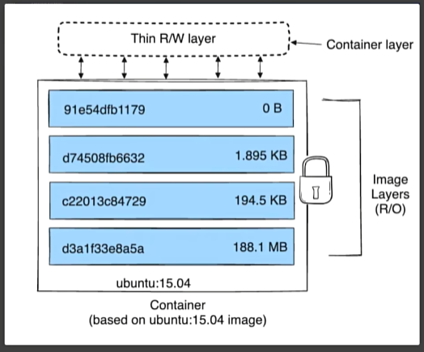

参考资料:https://www.yuque.com/leifengyang/sutong/au0lv3sv3eldsmn8#uhW2Q

视频：https://www.bilibili.com/video/BV1Zn4y1X7AZ

# 1. docker安装

官网安装流程：

https://docs.docker.com/engine/install/centos/

```shell
# 移除旧版本docker
sudo yum remove docker \
                  docker-client \
                  docker-client-latest \
                  docker-common \
                  docker-latest \
                  docker-latest-logrotate \
                  docker-logrotate \
                  docker-engine

# 配置docker yum源。这里修改为对应的阿里云源，更快
sudo yum install -y yum-utils
sudo yum-config-manager \
--add-repo \
http://mirrors.aliyun.com/docker-ce/linux/centos/docker-ce.repo


# 安装 最新 docker
sudo yum install -y docker-ce docker-ce-cli containerd.io docker-buildx-plugin docker-compose-plugin
# 启动docker
sudo systemctl start docker
# 可以使用docker命令，展示镜像
docker ps

# 启动& 开机启动docker； enable + start 二合一
systemctl enable docker --now

# 配置加速，默认去dockerhub的，可以配置国内镜像加速
sudo mkdir -p /etc/docker
sudo tee /etc/docker/daemon.json <<EOF
{
    "registry-mirrors": [
        "https://hub.uuuadc.top",
        "https://docker.anyhub.us.kg",
        "https://dockerhub.jobcher.com",
        "https://dockerhub.icu",
        "https://docker.ckyl.me",
        "https://docker.awsl9527.cn"
    ]
}
EOF

# 通知 systemd 重新加载其配置文件的命令
sudo systemctl daemon-reload
# 重启docker应用更改
sudo systemctl restart docker
```

dcoker-ce 就是docker引擎

docker-ce-cli 引擎的命令行程序

containerd.io 运行时环境

docker-buildx-plugin 构建镜像工具

docker-compose-plugin 批量工具


# 2. 常见命令
## 2.1 下载镜像

相关命令

```shell
docker search nginx #检索镜像
docker pull nginx#下载镜像
docker images #查看本地镜像列表
docker rmi #删除镜像
```

docker search nginx 


name为镜像名称，description为描述，stars为镜像的star数目，offical为是否官方

docker pull nginx


docker images(repository镜像标签 tag 镜像版本 image id 镜像id)


```
镜像名其实完成名称格式为
镜像名：标签(版本)
下载1.26版本为
docker pull nginx:1.26.0
```

docker rmi nginx:1.26.0

记得加上完整名字

## 2.2 启动容器

### 启动命令

```
docker run nginx #这里会阻塞命令行，后台启动在下文
```


换一个窗口用

```
docker ps
CONTAINER ID 应用id
IMAGE 镜像名称
COMMAND 启动命令
CREATED 启动时间
STATUS 启动多长 up代表成功
PORTS 占用端口
NAMES 随机名
```


在原本窗口停ctrl+c停止后，会发现docker ps不会显示有容器启动

如果用

```shell
docker ps -a
会显示所有容器，包括停止的
```


### 重新启动

```shell
docker start ec2 #使用容器id重新启动，可以只使用前几位id，用来与别的容器区分即可，就会发现重新启动起来了
docker start ecstatic_tesla #也可以使用容器名
```

### 停止容器

```shell
docker stop ecstatic_tesla #也可以使用容器名
```

### 重启

```shell
docker restart (id或者应用名)
```

### 查看状态

```shell
docker stats ec2 #用容器名也可以，以下同上
#显示也是动态变化的，跟top命令差不多
```


### 查看容器日志

```shell
docker logs ec2
```

### 删除容器

```shell
docker rm ec2 #运行中的容器会提示你需要先停止，或者用 force remove 就是加上 -f 命令行参数
```


### 后台启动

```shell
docker run -d --name mynginx nginx
#-d指定后台启动
#mynginx指定名字，要不然会随机名字
```

这时候虽然用docker ps查看虽然还是占用80端口，但是暂时还是不能访问，占用的是容器系统的80端口

### 端口映射

端口映射，宿主机的端口都是独立冲突的，容器的端口可以重复，因为互相不影响

```shell
#可以先将之前的容器删除掉，启动重名会提示冲突
docker run -d --name mynginx -p 80:80 nginx 
#这里-p指定端口映射，前面的是宿主机，后面的是容器端口
启动后docker ps查看
这里ports展示了对应的映射关系，如果是云主机，记得在安全规则开启80端口
```


### 进入容器

为后续修改容器内容做准备

```shell
docker exec -it mynginx /bin/bash
#-it交互模式进入容器
#mynginx 容器名
#交互方式 /bin/bash
容器有自己的文件系统
```


## 2.3 修改页面

nginx静态页面地址在

```shell
/usr/share/nginx/html
```


容器为了保持轻量化，是很多工具都没有安装的，先修改页面内容，后续可以映射docker存储到外部，可以不用总是进入容器修改


重新访问服务器80端口（提前做好映射），就可以发现已经改动完成


## 2.4 保存分享镜像

### 用容器生成镜像

可以使用docker commit命令


```shell
#docker commit 容器名或者id 镜像
docker commit -m "update index" mynginx mynginx:v1.0
#执行完后查看镜像列表就有了我们自己创建的镜像
```


### 保存镜像到文件

可以使用docker save命令，-o可以指定输出到什么文件

```shell
docker save -o mynginx.tar mynginx:v1.0
```


### 使用镜像文件

可以先删除本机所有镜像和容器

加载mynginx.tar 

```shell
docker load -i mynginx.tar
```


```shell
#重新启动容器,执行完后可以发现就是刚才自己修改的内容
docker run -d --name mynginx -p 80:80 mynginx:v1.0
```

### 分享镜像

#### 登录

https://hub.docker.com/


#### 命名

先给镜像改名，需要（用户名/镜像名）

```shell
docker tag mynginx:v1.0 simbaada/mynginx:v1.0
```


#### 推送(国内可能会timeout)

```shell
docker push simbaada/mynginx:v1.0
```

## 2.5 命令总结

```shell
#查看运行中的容器
docker ps
#查看所有容器
docker ps -a
#搜索镜像
docker search nginx
#下载镜像
docker pull nginx
#下载指定版本镜像
docker pull nginx:1.26.0
#查看所有镜像
docker images
#删除指定id的镜像（镜像id）
docker rmi xxxxxx


#运行一个新容器
docker run nginx
#停止容器
docker stop keen_blackwell
#启动容器
docker start ec2
#重启容器
docker restart ec2
#查看容器资源占用情况
docker stats ec2
#查看容器日志
docker logs ec2
#删除指定容器
docker rm ec2
#强制删除指定容器
docker rm -f ec2
# 后台启动容器
docker run -d --name mynginx nginx
# 后台启动并暴露端口
docker run -d --name mynginx -p 80:80 nginx
# 进入容器内部
docker exec -it mynginx /bin/bash

# 提交容器变化打成一个新的镜像
docker commit -m "update index.html" mynginx mynginx:v1.0
# 保存镜像为指定文件
docker save -o mynginx.tar mynginx:v1.0
# 删除多个镜像
docker rmi bde7d154a67f 94543a6c1aef e784f4560448
# 加载镜像
docker load -i mynginx.tar 


# 登录 docker hub
docker login
# 重新给镜像打标签
docker tag mynginx:v1.0 simbaada/mynginx:v1.0
# 推送镜像
docker push simbaada/mynginx:v1.0
# 批量删除容器命令
#慎用，不要把有用的删掉了
#docker ps -aq 获取当前所有的容器ID
docker rm -f $(docker ps -aq)
```
以上为所有命令总结

# 3. 存储(目录挂载，卷映射)

## 3.1 目录挂载

在上面我们如果要修改nginx的文件需要进入容器内部

```shell
docker exce -it 4f231d6ce759 bash #4f231d6ce759为容器id bash为交互方式
```

修改了容器内的文件后，容器移除或者出问题则数据文件会丢失，

**这时候就需要将外部文件挂载到容器中**

```shell
#在启动容器的时候-v即可
#-v 外服文件位置:容器内文件位置
-v /app/nghtml:/usr/share/nginx/html
```

执行以下命令

```shell
docker run -d -p 80:80 -v /app/nghtml:/usr/share/nginx/html --name app01 nginx
```

同时还会**自动创建目录**


这时候访问80端口会发现是403，因为nginx文件挂载到了外部，但是外部没有index.html

我们创建文件,再访问就会发现对应的页面有内容了

```shell
echo hello. > index.html #后续卷映射也用到这个文件
```

你再删掉这个容器，重新执行上面的挂载启动内容命令，还是可以的

**进入内部修改文件，同样是可以修改外部文件的。**

## 3.2 卷映射

如果挂载的是配置文件夹/etc/nginx/

```shell
docker run -d -p 80:80 -v /app/nghtml:/usr/share/nginx/html -v /app/ngconf:/etc/nginx --name app02 nginx
```


这时候可能会启动不来容器，因为先生成外部空目录，挂载到内部后，相当于内部什么也没有，容器启动找不到配置文件，除非提前放入配置文件。默认是以外部文件为准。

需要一个初始化跟内部保持一致的挂载方式，这就叫**卷映射**。

卷就是一个存储，计算机以前是用一卷纸打孔方式存储。

命令形式：

```shell
# 不以.或者./开始的就视为卷映射
-v ngconf:/etc/nginx
```

卷映射配置文件，开启一个新容器

```shell
docker run -d -p 99:80 -v /app/nghtml:/usr/share/nginx/html -v ngconf:/etc/nginx --name new_app nginx
```


访问99端口就可以看到hello.了，之前我们修改的index文件

### 修改卷映射的目录内容

docker统一把卷映射放在了`/var/lib/docker/volumes/<volumes-name>`下

这时候修改内容，容器内部也会有变动，跟目录挂载相同


## 3.3 总结

目录挂载`-v /app/nghtml:/usr/share/nginx/html`：初始启动，外面目录与内部目录都是空的，互相同步

卷映射`-v ngconf:/etc/nginx`：初始启动，外面目录以内部目录为准，互相同步

**删除容器，卷不会被删除**

```shell
#列出所有的卷
docker volume ls
#创建卷
docker volume create newvolume
#查看卷详情，列出创建时间，所在目录等
docker volume inspect ngconf
```


# 4. 网络

## 4.1 容器访问容器

创建两个容器，进入app1，访问app2


```shell
docker run -d -p 80:80 --name app1 nginx
docker run -d -p 90:80 --name app2 nginx
docker exec -it app1 bash
#在app1里访问app2，这里x.x.x.x是你自己的服务器地址
curl http://x.x.x.x:90
```


但是这样会比较麻烦，其实是访问了外部网络让后再进来。

其实装了docker后，**docker会在本地装一个docker0网卡**

可以使用`ip a`查看

docker创建容器后都会加入这个网络，然后也会分配对应的ip地址


```shell
#查看容器细节
docker container inspect app1
#也可以直接用inspect，可以看到容器的id，查看app2也是一样的,如果只有两个容器，这时候app2应为172.17.0.3
docker inspect app1
```


这时候进入app1，重新执行`curl http://172.17.0.3:80 `,就可以访问首页了（**注意，这里直接用容器内部端口即可**）


## 4.2 网络访问固定

ocker为每个容器分配唯一ip，就可以使用`容器ip+容器端口`互相访问

ip可能随时变化，docker0默认不支持主机域名

我们可以**创建自定义网络，容器名就是稳定域名**

```shell
#创建自定义网络
docker network create mynet
#查看网络列表
docker network ls
```


删掉之前的容器，重新创建两个,使用--network指定网络

```shell
docker run -d -p 80:80 --name app1 --network mynet nginx #创建后inspect查看详情，这个是172.18.0.2
docker run -d -p 90:80 --name app2 --network mynet nginx #创建后inspect查看详情，这个是172.18.0.3
```

进入app1，访问app2的内容

**容器的名就是访问的域名**

```shell
docker exec -it app1 bash
curl http://app2:80 #直接访问容器，使用容器的80端口，这里用172.18.0.3也可以的
```


## 4.3 总结

1. docker为每个容器分配唯一ip，就可以使用`容器ip+容器端口`互相访问

   ip可能随时变化，docker0默认不支持主机域名

2. 我们可以**创建自定义网络，容器名就是稳定域名**
3. 创建自定义网络并且重新开启容器后，可以用容器id，或者容器名直接访问，记得端口是容器内部端口

# 5. 网络实践

## 5.1 Redis主从复制集群

### 初始化环境，开启容器

1. redis01作为主集，负责写；redis02作为从集，负责读
2. redis01端口映射（外服:内部->6379:6379）；redis02端口映射（外部:内部->6380:6389）
3. redis实例保存数据的目录挂载到外部目录（redis01->/app/rd1；redis02->/app/rd2）
4. 采用自己创建的docker网络mynet
5. 采用bitnami的redis镜像(修改环境变量即可)，因为官方的还要修改配置文件，这里做实验用就图方便，参数可以查看dockehub里的bitnami/redis文档

```shell
#设置主集
REDIS_REPLICATION_MODE=master
REDIS_PASSWORD=123456
#设置从集
REDIS_REPLICATION_MODE=slave
REDIS_MASTER_HOST=redis01 #主集地址，域名形式
REDIS_MASTER_PORT_NUMBER=6379 #主集端口，因为是docker内部访问，都是内部端口6379
REDIS_MASTER_PASSWORD=123456 #主集密码
REDIS_PASSWORD=123456 #从集密码
```

记得提前定义网络

```shell
#自定义网络
docker network create mynet
#下载好镜像
docker pull bitnami/redis
```

创建主集，命令过长可以用反斜线，其中`-e`是指定环境变量

```shell
docker run -d -p 6379:6379 \
-v /app/rd1:/bitnami/redis/data \
-e REDIS_REPLICATION_MODE=master \
-e REDIS_PASSWORD=123456 \
--network mynet --name redis01 \
bitnami/redis
```

这里会有个错误，因为创建的目录rd1只有root用户可读可写，`chmod -R 777 rd1`修改了重新启动即可，同理直接创建rd2修改权限，然后`docker restart 容器id`重启之前的容器即可


启动从集

```shell
docker run -d -p 6380:6379 \
-v /app/rd2:/bitnami/redis/data \
-e REDIS_REPLICATION_MODE=slave \
-e REDIS_MASTER_HOST=redis01 \
-e REDIS_MASTER_PORT_NUMBER=6379 \
-e REDIS_MASTER_PASSWORD=123456 \
-e REDIS_PASSWORD=123456 \
--network mynet --name redis02 \
bitnami/redis
```

### 验证

当两个容器都启动完成后，用RedisDesktopManager连接到服务器的两个redis容器，记得开启防火墙规则端口，6379，6380

RedisDesktopManager可以去github下载：https://github.com/lework/RedisDesktopManager-Windows


1. 写数据到master

   

2. 查看从集

   

3. 修改同样可以同步

4. 这只是实验，真正的生产环境更复杂

5. 启动一个mysql容器

   挂载配置文件，挂载数据存储，设置root密码

   ```shell
   docker run -d -p 3306:3306 \
   -v /app/myconf:/etc/mysql/conf.d \
   -v /app/mydata:/var/lib/mysql \
   -e MYSQL_ROOT_PASSWORD=123456 \
   mysql:8.0.37-debian
   ```


# 6. Dokcer Compose

## 6.1 概述

Docker Compose 是一个用于定义和运行多容器 Docker 应用的工具。通过使用一个叫做 `docker-compose.yml` 的配置文件，您可以配置应用所需的所有服务，然后通过一个简单的命令启动它们。

1. 定义多容器应用：在一个`docker-compose.yml`文件中定义需要的所有服务
2. 一键启动和停止：使用简单命令`docker compose up -d`(-d是后台启动) 启动所有服务，`docker compose down`停止并且清理服务
3. 服务编排：自动处理容器之间依赖和启动顺序
4. 共享网络：所有容器默认共享一个网络
5. 持久化数据：使用卷保存数据

```shell
#后台启动
docker compose up -d
#停止并且清理服务
docker compose down
#重新启动配置的x1,x2,x3服务(这里是重新启动的意思，已经第一次启动过了)
docker compose start x1 x2 x3
#停止容器
docker compose stop x1 x3
#扩容,让x2启动三份
docker compose scale x2=3
```


## 6.2 命令式安装一个wordpress博客

创建共享网络

```shell
docker network create blog
```

启动mysql

```shell
#其中MYSQL_DATABASE为启动后默认创建数据库，/app/myconf为指定配置文件，--restart always指定开机默认启动
docker run -d -p 3306:3306 \
-e MYSQL_ROOT_PASSWORD=123456 \
-e MYSQL_DATABASE=wordpress \
-v mysql-data:/var/lib/mysql \
-v /app/myconf:/etc/mysql/conf.d \
--restart always --name mysql \
--network blog \
mysql:8.0
```

启动wordpress

```shell
# WORDPRESS开头环境变量指定对应的需求环境变量，-v wordpress指定卷，
docker run -d -p 8080:80 \
-e WORDPRESS_DB_HOST=mysql \
-e WORDPRESS_DB_USER=root \
-e WORDPRESS_DB_PASSWORD=123456 \
-e WORDPRESS_DB_NAME=wordpress \
-v wordpress:/var/www/html \
--restart always --name wordpress-app \
--network blog \
wordpress:latest
```

记得开启对应端口防火墙

这时候登录xxxxx:8080即可

## 6.3 Dokcer Compose文件

官方文档：https://docs.docker.com/reference/

可以一次性编排整个需要的容器名字，配置项，启动项，文件，网络，服务等

这下如果需要一次性生成上述的一个博客系统，就不需要每次去执行所有命令

### 文件顶级元素

```
name:名字
services:服务
networks:网络
volumes:卷
configs:配置
secrets:密钥
```

### 示例

```yaml
name: myblog 				#部署的应用名
services:
    mysql:
        container_name: mysql
        image: mysql:8.0 	#镜像
        ports:				#端口,可能有多个端口，下面会用-开始，以下同理
            - "3306:3306"
        environment:		#环境变量
            - MYSQL_ROOT_PASSWORD=123456
            - MYSQL_DATABASE=wordpress
        volumes:			#卷
            - mysql-data:/var/lib/mysql #卷挂载,要跨多个服务重用卷，必须在volumes顶级元素中声明命名卷
            - /app/myconf:/etc/mysql/conf.d #目录挂载
        restart: always
        networks:
            - blog
    wordpress:
        container_name: wordpress-app
        image: wordpress
        ports:
            - "8080:80"
        environment:
            - WORDPRESS_DB_HOST=mysql
            - WORDPRESS_DB_USER=root
            - WORDPRESS_DB_PASSWORD=123456
            - WORDPRESS_DB_NAME=wordpress
        volumes:
            - wordpress:/var/www/html    
        restart: always
        networks:
            - blog
        depends_on: #决定启动顺序，需要mysql先启动
            mysql
volumes:
    mysql-data: #还可以配置卷详细信息
    wordpress:
networks:
    blog:
```

使用命令删除之前的容器，网络，卷，保持环境干净，然后使用compose一次性操作

```shell
docker rm -f $(docker ps -aq)
docker network rm blog
docker volume rm mysql-data wordpress
```

执行命令

```shell
docker compose -f compose.yaml up -d
```

可能会有一些报错


可以看到网络名会变成`应用名-网络名`的格式，卷格式也`应用名-卷名`,如果没有给容器名，则会是`myblog-wordpress-1`的格式

这时候重新去访问x.x.x.x:8080就是跟之前一样的内容了。


### 示例2

我们将wordpress端口从`8080:80`改为`80:80`，去掉wordpress的container_name试试

然后重新执行一次`docker compose -f compose.yaml up -d`


会发现，重新修改容器为80端口，重新启动了一个，并且名字变为了myblog-wordpress-1

### 执行down命令

```shell
docker compose -f compose.yaml down
```


发现移除了容器，移除了网络，但是其实并没有移除卷，这样下次启动，还可以使用同样的卷


其实也可以加上-v移除卷,--rmi 移除镜像

```shell
docker compose -f compose.yaml down --rmi all -v
```


# 7. Dockerfile

官方文档：https://docs.docker.com/reference/dockerfile/

## 制作自己的镜像

目的：构建自定义镜像，将自己的应用打包成一个镜像


1. 指定基础运行环境
2. 需要的软件包
3. 启动命令

| 常见指令   | 作用                                                         |
| ---------- | ------------------------------------------------------------ |
| FROM       | 指定镜像基础环境                                             |
| RUN        | 运行自定义命令                                               |
| CMD        | 容器启动命令或者参数                                         |
| LABEL      | 自定义标签                                                   |
| EXPOSE     | 指定暴露端口，其实并不是真的发布端口，可以理解为一种约束文档<br>后续运行还是要通过-p真的去暴露端口 |
| ENV        | 环境变量                                                     |
| ADD        | 添加文件到镜像，可以自动解压缩，还可以远程下载文件并且复制   |
| COPY       | 复制文件到镜像，只能复制本地的，不会解压缩                   |
| ENTRYPOINT | 容器固定启动命令,数组类型是首选形式                          |
| VOLUME     | 数据卷                                                       |
| USER       | 指定用户和用户组                                             |
| WORKDIR    | 指定默认工作目录                                             |
| ARG        | 指定构建参数                                                 |

下载参考资料中的app.jar，传到服务器

编写dockerfile

```dockerfile
FROM openjdk:17
LABEL author=simba
COPY app.jar /app.jar
EXPOSE 8080
ENTRYPOINT ["java","-jar","app.jar"]
```

保证dockerfile跟app.jar在同一目录,执行如下命令

最后需要一个`.`,指定上下文目录，**这个点代表的是当前目录，很重要**

```shell
docker build -f Dockerfile -t myjavaapp:v1.0 .
```

这时候就在我们本地镜像就可以看到myjavaapp这个镜像了


```
docker run -d -p 8888:8080 myjavaapp:v1.0
```

这时候就可以去访问x.x.x.x:8888,查看效果，会在网页打印“hello,world”，x.x.x.x为你服务器地址，记得放开8888端口

## 制作一个python，fastapi镜像

创建一个app镜像，目录内容如下

```
work
├── Dockerfile
└── app
    └── main.py
```

其中main.py内容

```python
from fastapi import FastAPI

app = FastAPI()

@app.get("/")
def read_root():
    return {"message": "hello, python-fastapi"}
```

Dockerfile内容如下(这里修改pip为清华源，可以加速下载)

```dockerfile
FROM python:3.9-slim
WORKDIR /app
COPY ./app /app
RUN pip config set global.index-url https://pypi.tuna.tsinghua.edu.cn/simple
RUN pip config set global.trusted-host https://pypi.tuna.tsinghua.edu.cn
RUN pip install fastapi uvicorn
EXPOSE 8080
CMD ["uvicorn", "main:app", "--host", "0.0.0.0", "--port", "8080"]
```

确保在work目录下，执行如下命令构建镜像

```shell
docker build -t fastapi-app .
```

启动容器

```
docker run -d -p 8999:8080 --name myfastapi fastapi-app
```


然后打开8999端口，访问x.x.x.x:8999就可以看到`{"message":"hello, python-fastapi"}`这个内容了。

python没有打包的概念，所以这里直接是代码文件进去的。

## 镜像分层存储机制

docker存储镜像是分层存储的

dockerfile每一个行指令都会产生一个存储层，因为每个层都会产生改变，文件，环境等等。这样的好处是减轻磁盘存储压力


如下，app1和app2共用了底层，然后增量存储自己要的东西。


可以查看我们的mynginx:v1.0与nginx的区别，可以看到mynginx与nginx只有1.32kb的区别


也可以用docker image imspect查看两个镜像的存储内容。

镜像存储内容是R/O，是只读的，容器启动会单独开一次，R/W的可读可写，容器修改数据只会在自己的层。所以容器修改的数据在删除后就不存在了



每个容器都有自己的R/W层，互不相干，然后又有可能引用同样的镜像存储层。推荐修改的数据挂载到外部


使用如下命令,可以查看对应容器消耗的存储

```shell
docker ps -s
```


# 8. 一键启动


一次启动如上所有容器(其中的x.x.x.x改成自己的服务器地址即可)

```yaml
name: devsoft
services:
  redis:
    image: bitnami/redis:latest
    restart: always
    container_name: redis
    environment:
      - REDIS_PASSWORD=123456
    ports:
      - '6379:6379'
    volumes:
      - redis-data:/bitnami/redis/data
      - redis-conf:/opt/bitnami/redis/mounted-etc
      - /etc/localtime:/etc/localtime:ro

  mysql:
    image: mysql:8.0.31
    restart: always
    container_name: mysql
    environment:
      - MYSQL_ROOT_PASSWORD=123456
    ports:
      - '3306:3306'
      - '33060:33060'
    volumes:
      - mysql-conf:/etc/mysql/conf.d
      - mysql-data:/var/lib/mysql
      - /etc/localtime:/etc/localtime:ro

  rabbit:
    image: rabbitmq:3-management
    restart: always
    container_name: rabbitmq
    ports:
      - "5672:5672"
      - "15672:15672"
    environment:
      - RABBITMQ_DEFAULT_USER=rabbit
      - RABBITMQ_DEFAULT_PASS=rabbit
      - RABBITMQ_DEFAULT_VHOST=dev
    volumes:
      - rabbit-data:/var/lib/rabbitmq
      - rabbit-app:/etc/rabbitmq
      - /etc/localtime:/etc/localtime:ro
  opensearch-node1:
    image: opensearchproject/opensearch:2.13.0
    container_name: opensearch-node1
    environment:
      - cluster.name=opensearch-cluster # Name the cluster
      - node.name=opensearch-node1 # Name the node that will run in this container
      - discovery.seed_hosts=opensearch-node1,opensearch-node2 # Nodes to look for when discovering the cluster
      - cluster.initial_cluster_manager_nodes=opensearch-node1,opensearch-node2 # Nodes eligibile to serve as cluster manager
      - bootstrap.memory_lock=true # Disable JVM heap memory swapping
      - "OPENSEARCH_JAVA_OPTS=-Xms512m -Xmx512m" # Set min and max JVM heap sizes to at least 50% of system RAM
      - "DISABLE_INSTALL_DEMO_CONFIG=true" # Prevents execution of bundled demo script which installs demo certificates and security configurations to OpenSearch
      - "DISABLE_SECURITY_PLUGIN=true" # Disables Security plugin
    ulimits:
      memlock:
        soft: -1 # Set memlock to unlimited (no soft or hard limit)
        hard: -1
      nofile:
        soft: 65536 # Maximum number of open files for the opensearch user - set to at least 65536
        hard: 65536
    volumes:
      - opensearch-data1:/usr/share/opensearch/data # Creates volume called opensearch-data1 and mounts it to the container
      - /etc/localtime:/etc/localtime:ro
    ports:
      - 9200:9200 # REST API
      - 9600:9600 # Performance Analyzer

  opensearch-node2:
    image: opensearchproject/opensearch:2.13.0
    container_name: opensearch-node2
    environment:
      - cluster.name=opensearch-cluster # Name the cluster
      - node.name=opensearch-node2 # Name the node that will run in this container
      - discovery.seed_hosts=opensearch-node1,opensearch-node2 # Nodes to look for when discovering the cluster
      - cluster.initial_cluster_manager_nodes=opensearch-node1,opensearch-node2 # Nodes eligibile to serve as cluster manager
      - bootstrap.memory_lock=true # Disable JVM heap memory swapping
      - "OPENSEARCH_JAVA_OPTS=-Xms512m -Xmx512m" # Set min and max JVM heap sizes to at least 50% of system RAM
      - "DISABLE_INSTALL_DEMO_CONFIG=true" # Prevents execution of bundled demo script which installs demo certificates and security configurations to OpenSearch
      - "DISABLE_SECURITY_PLUGIN=true" # Disables Security plugin
    ulimits:
      memlock:
        soft: -1 # Set memlock to unlimited (no soft or hard limit)
        hard: -1
      nofile:
        soft: 65536 # Maximum number of open files for the opensearch user - set to at least 65536
        hard: 65536
    volumes:
      - /etc/localtime:/etc/localtime:ro
      - opensearch-data2:/usr/share/opensearch/data # Creates volume called opensearch-data2 and mounts it to the container

  opensearch-dashboards:
    image: opensearchproject/opensearch-dashboards:2.13.0
    container_name: opensearch-dashboards
    ports:
      - 5601:5601 # Map host port 5601 to container port 5601
    expose:
      - "5601" # Expose port 5601 for web access to OpenSearch Dashboards
    environment:
      - 'OPENSEARCH_HOSTS=["http://opensearch-node1:9200","http://opensearch-node2:9200"]'
      - "DISABLE_SECURITY_DASHBOARDS_PLUGIN=true" # disables security dashboards plugin in OpenSearch Dashboards
    volumes:
      - /etc/localtime:/etc/localtime:ro
  zookeeper:
    image: bitnami/zookeeper:3.9
    container_name: zookeeper
    restart: always
    ports:
      - "2181:2181"
    volumes:
      - "zookeeper_data:/bitnami"
      - /etc/localtime:/etc/localtime:ro
    environment:
      - ALLOW_ANONYMOUS_LOGIN=yes

  kafka:
    image: 'bitnami/kafka:3.4'
    container_name: kafka
    restart: always
    hostname: kafka
    ports:
      - '9092:9092'
      - '9094:9094'
    environment:
      - KAFKA_CFG_NODE_ID=0
      - KAFKA_CFG_PROCESS_ROLES=controller,broker
      - KAFKA_CFG_LISTENERS=PLAINTEXT://:9092,CONTROLLER://:9093,EXTERNAL://0.0.0.0:9094
      - KAFKA_CFG_ADVERTISED_LISTENERS=PLAINTEXT://kafka:9092,EXTERNAL://x.x.x.x:9094
      - KAFKA_CFG_LISTENER_SECURITY_PROTOCOL_MAP=CONTROLLER:PLAINTEXT,EXTERNAL:PLAINTEXT,PLAINTEXT:PLAINTEXT
      - KAFKA_CFG_CONTROLLER_QUORUM_VOTERS=0@kafka:9093
      - KAFKA_CFG_CONTROLLER_LISTENER_NAMES=CONTROLLER
      - ALLOW_PLAINTEXT_LISTENER=yes
      - "KAFKA_HEAP_OPTS=-Xmx512m -Xms512m"
    volumes:
      - kafka-conf:/bitnami/kafka/config
      - kafka-data:/bitnami/kafka/data
      - /etc/localtime:/etc/localtime:ro
  kafka-ui:
    container_name: kafka-ui
    image: provectuslabs/kafka-ui:latest
    restart: always
    ports:
      - 8080:8080
    environment:
      DYNAMIC_CONFIG_ENABLED: true
      KAFKA_CLUSTERS_0_NAME: kafka-dev
      KAFKA_CLUSTERS_0_BOOTSTRAPSERVERS: kafka:9092
    volumes:
      - kafkaui-app:/etc/kafkaui
      - /etc/localtime:/etc/localtime:ro

  nacos:
    image: nacos/nacos-server:v2.3.1
    container_name: nacos
    ports:
      - 8848:8848
      - 9848:9848
    environment:
      - PREFER_HOST_MODE=hostname
      - MODE=standalone
      - JVM_XMX=512m
      - JVM_XMS=512m
      - SPRING_DATASOURCE_PLATFORM=mysql
      - MYSQL_SERVICE_HOST=nacos-mysql
      - MYSQL_SERVICE_DB_NAME=nacos_devtest
      - MYSQL_SERVICE_PORT=3306
      - MYSQL_SERVICE_USER=nacos
      - MYSQL_SERVICE_PASSWORD=nacos
      - MYSQL_SERVICE_DB_PARAM=characterEncoding=utf8&connectTimeout=1000&socketTimeout=3000&autoReconnect=true&useUnicode=true&useSSL=false&serverTimezone=Asia/Shanghai&allowPublicKeyRetrieval=true
      - NACOS_AUTH_IDENTITY_KEY=2222
      - NACOS_AUTH_IDENTITY_VALUE=2xxx
      - NACOS_AUTH_TOKEN=SecretKey012345678901234567890123456789012345678901234567890123456789
      - NACOS_AUTH_ENABLE=true
    volumes:
      - /app/nacos/standalone-logs/:/home/nacos/logs
      - /etc/localtime:/etc/localtime:ro
    depends_on:
      nacos-mysql:
        condition: service_healthy
  nacos-mysql:
    container_name: nacos-mysql
    build:
      context: .
      dockerfile_inline: |
        FROM mysql:8.0.31
        ADD https://raw.githubusercontent.com/alibaba/nacos/2.3.2/distribution/conf/mysql-schema.sql /docker-entrypoint-initdb.d/nacos-mysql.sql
        RUN chown -R mysql:mysql /docker-entrypoint-initdb.d/nacos-mysql.sql
        EXPOSE 3306
        CMD ["mysqld", "--character-set-server=utf8mb4", "--collation-server=utf8mb4_unicode_ci"]
    image: nacos/mysql:8.0.30
    environment:
      - MYSQL_ROOT_PASSWORD=root
      - MYSQL_DATABASE=nacos_devtest
      - MYSQL_USER=nacos
      - MYSQL_PASSWORD=nacos
      - LANG=C.UTF-8
    volumes:
      - nacos-mysqldata:/var/lib/mysql
      - /etc/localtime:/etc/localtime:ro
    ports:
      - "13306:3306"
    healthcheck:
      test: [ "CMD", "mysqladmin" ,"ping", "-h", "localhost" ]
      interval: 5s
      timeout: 10s
      retries: 10
  prometheus:
    image: prom/prometheus:v2.52.0
    container_name: prometheus
    restart: always
    ports:
      - 9090:9090
    volumes:
      - prometheus-data:/prometheus
      - prometheus-conf:/etc/prometheus
      - /etc/localtime:/etc/localtime:ro

  grafana:
    image: grafana/grafana:10.4.2
    container_name: grafana
    restart: always
    ports:
      - 3000:3000
    volumes:
      - grafana-data:/var/lib/grafana
      - /etc/localtime:/etc/localtime:ro

volumes:
  redis-data:
  redis-conf:
  mysql-conf:
  mysql-data:
  rabbit-data:
  rabbit-app:
  opensearch-data1:
  opensearch-data2:
  nacos-mysqldata:
  zookeeper_data:
  kafka-conf:
  kafka-data:
  kafkaui-app:
  prometheus-data:
  prometheus-conf:
  grafana-data:
```

删除之前所有镜像还有卷

```shell
docker rm -f $(docker ps -aq)
docker volume rm $(docker volume ls -q)
```

opensearch需要增大内存映射数目,执行一下下面的内容

```shell
#Disable memory paging and swapping performance 关闭内存分页
sudo swapoff -a

# Edit the sysctl config file
sudo vi /etc/sysctl.conf

# Add a line to define the desired value
# or change the value if the key exists,
# and then save your changes.修改内存最大映射数
vm.max_map_count=262144

# Reload the kernel parameters using sysctl 使用配置生效
sudo sysctl -p

# Verify that the change was applied by checking the value
cat /proc/sys/vm/max_map_count
```

编辑好compose.yaml文件后，执行

```
docker compose up -d
```

需要比较高性能服务器。

