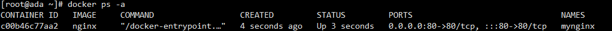

# docker安装

官网安装流程：

https://docs.docker.com/engine/install/centos/

```shell
# 移除旧版本docker
sudo yum remove docker \
                  docker-client \
                  docker-client-latest \
                  docker-common \
                  docker-latest \
                  docker-latest-logrotate \
                  docker-logrotate \
                  docker-engine

# 配置docker yum源。这里修改为对应的阿里云源，更快
sudo yum install -y yum-utils
sudo yum-config-manager \
--add-repo \
http://mirrors.aliyun.com/docker-ce/linux/centos/docker-ce.repo


# 安装 最新 docker
sudo yum install -y docker-ce docker-ce-cli containerd.io docker-buildx-plugin docker-compose-plugin
# 启动docker
sudo systemctl start docker
# 可以使用docker命令，展示镜像
docker ps

# 启动& 开机启动docker； enable + start 二合一
systemctl enable docker --now

# 配置加速，默认去dockerhub的，可以配置国内镜像加速
sudo mkdir -p /etc/docker
sudo tee /etc/docker/daemon.json <<-'EOF'
{
  "registry-mirrors": ["https://82m9ar63.mirror.aliyuncs.com"]
}
EOF

# 通知 systemd 重新加载其配置文件的命令
sudo systemctl daemon-reload
# 重启docker应用更改
sudo systemctl restart docker
```

dcoker-ce 就是docker引擎

docker-ce-cli 引擎的命令行程序

containerd.io 运行时环境

docker-buildx-plugin 构建镜像工具

docker-compose-plugin 批量工具


# 常见命令
### 下载镜像

相关命令

```shell
docker search nginx #检索镜像
docker pull nginx#下载镜像
docker images #查看本地镜像列表
docker rmi #删除镜像
```

docker search nginx 


name为镜像名称，description为描述，stars为镜像的star数目，offical为是否官方

docker pull nginx


docker images(repository镜像标签 tag 镜像版本 image id 镜像id)


```
镜像名其实完成名称格式为
镜像名：标签(版本)
下载1.26版本为
docker pull nginx:1.26.0
```

docker rmi nginx:1.26.0

记得加上完整名字

### 启动容器

#### 启动命令

```
docker run nginx #这里会阻塞命令行，后台启动在下文
```


换一个窗口用

```
docker ps
CONTAINER ID 应用id
IMAGE 镜像名称
COMMAND 启动命令
CREATED 启动时间
STATUS 启动多长 up代表成功
PORTS 占用端口
NAMES 随机名
```


在原本窗口停ctrl+c停止后，会发现docker ps不会显示有容器启动

如果用

```shell
docker ps -a
会显示所有容器，包括停止的
```


#### 重新启动

```shell
docker start ec2 #使用容器id重新启动，可以只使用前几位id，用来与别的容器区分即可，就会发现重新启动起来了
docker start ecstatic_tesla #也可以使用容器名
```

#### 停止容器

```shell
docker stop ecstatic_tesla #也可以使用容器名
```

#### 重启

```shell
docker restart (id或者应用名)
```

#### 查看状态

```shell
docker stats ec2 #用容器名也可以，以下同上
#显示也是动态变化的，跟top命令差不多
```


#### 查看容器日志

```shell
docker logs ec2
```

#### 删除容器

```shell
docker rm ec2 #运行中的容器会提示你需要先停止，或者用 force remove 就是加上 -f 命令行参数
```


#### 后台启动

```shell
docker run -d --name mynginx nginx
#-d指定后台启动
#mynginx指定名字，要不然会随机名字
```

这时候虽然用docker ps查看虽然还是占用80端口，但是暂时还是不能访问，占用的是容器系统的80端口

#### 端口映射

端口映射，宿主机的端口都是独立冲突的，容器的端口可以重复，因为互相不影响

```shell
#可以先将之前的容器删除掉，启动重名会提示冲突
docker run -d --name mynginx -p 80:80 nginx 
#这里-p指定端口映射，前面的是宿主机，后面的是容器端口
启动后docker ps查看
这里ports展示了对应的映射关系，如果是云主机，记得在安全规则开启80端口
```



#### 进入容器

为后续修改容器内容做准备

```shell
docker exec -it mynginx /bin/bash
#-it交互模式进入容器
#mynginx 容器名
#交互方式 /bin/bash
容器有自己的文件系统
```


### 修改页面

nginx静态页面地址在

```shell
/usr/share/nginx/html
```


容器为了保持轻量化，是很多工具都没有安装的，先修改页面内容，后续可以映射docker存储到外部，可以不用总是进入容器修改


重新访问服务器80端口（提前做好映射），就可以发现已经改动完成


### 保存分享镜像

#### 用容器生成镜像

可以使用docker commit命令


```shell
#docker commit 容器名或者id 镜像
docker commit -m "update index" mynginx mynginx:v1.0
#执行完后查看镜像列表就有了我们自己创建的镜像
```


#### 保存镜像到文件

可以使用docker save命令，-o可以指定输出到什么文件

```shell
docker save -o mynginx.tar mynginx:v1.0
```


#### 使用镜像文件

可以先删除本机所有镜像和容器

加载mynginx.tar 

```shell
docker load -i mynginx.tar
```


```shell
#重新启动容器,执行完后可以发现就是刚才自己修改的内容
docker run -d --name mynginx -p 80:80 mynginx:v1.0
```

#### 分享镜像

##### 登录

https://hub.docker.com/


##### 命名

先给镜像改名，需要（用户名/镜像名）

```shell
docker tag mynginx:v1.0 simbaada/mynginx:v1.0
```


##### 推送(国内可能会timeout)

```shell
docker push simbaada/mynginx:v1.0
```

### 命令总结

```shell
#查看运行中的容器
docker ps
#查看所有容器
docker ps -a
#搜索镜像
docker search nginx
#下载镜像
docker pull nginx
#下载指定版本镜像
docker pull nginx:1.26.0
#查看所有镜像
docker images
#删除指定id的镜像（镜像id）
docker rmi xxxxxx


#运行一个新容器
docker run nginx
#停止容器
docker stop keen_blackwell
#启动容器
docker start ec2
#重启容器
docker restart ec2
#查看容器资源占用情况
docker stats ec2
#查看容器日志
docker logs ec2
#删除指定容器
docker rm ec2
#强制删除指定容器
docker rm -f ec2
# 后台启动容器
docker run -d --name mynginx nginx
# 后台启动并暴露端口
docker run -d --name mynginx -p 80:80 nginx
# 进入容器内部
docker exec -it mynginx /bin/bash

# 提交容器变化打成一个新的镜像
docker commit -m "update index.html" mynginx mynginx:v1.0
# 保存镜像为指定文件
docker save -o mynginx.tar mynginx:v1.0
# 删除多个镜像
docker rmi bde7d154a67f 94543a6c1aef e784f4560448
# 加载镜像
docker load -i mynginx.tar 


# 登录 docker hub
docker login
# 重新给镜像打标签
docker tag mynginx:v1.0 simbaada/mynginx:v1.0
# 推送镜像
docker push simbaada/mynginx:v1.0
```

