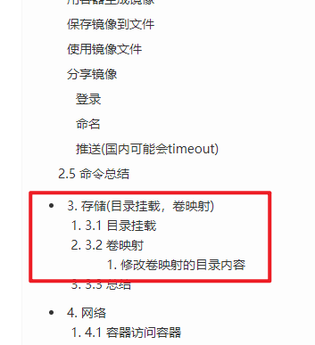
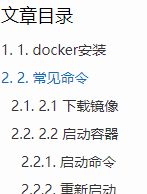
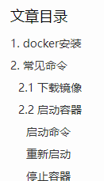

# pure主题左侧侧边栏页面点击返回404

在一些左侧侧边栏，刚搭建完是有首页、归档.....关于等一些内容
但是大部分是需要自己定制的
可以将themes\pure\_source 目录下的内容复制到自己的source目录下
执行

```
hexo clean
hexo g
hexo s
```
在本地查看，即可发现对应的页面已经不再是404
相关的一些内容配置，是在主题配置的_config.yml中

# 点开文章不显示目录问题

1. 把layout/_partial/post/nav.ejs，layout/_partial/sidebar-toc.ejs里的&& post.toc删掉
2. sidebar-toc.ejs把collapse这个样式去掉可以了，这个样式写了一个display:none!important; 不知道为什么要隐藏
   Mark一下

https://github.com/cofess/hexo-theme-pure/issues/125#issuecomment-529211389

# 目录显示错误



原因：markdown文件编写时候目录层级不对

解决办法：一级别目录用一个#，二级别目录就必须是两个##，不能是三个或者四个

# 去掉目录额外编号



全局搜索

```
 <%- toc(post.content) %>
```

改为

```
<%- toc(post.content, {list_number:false}) %>
```

新效果如下：

