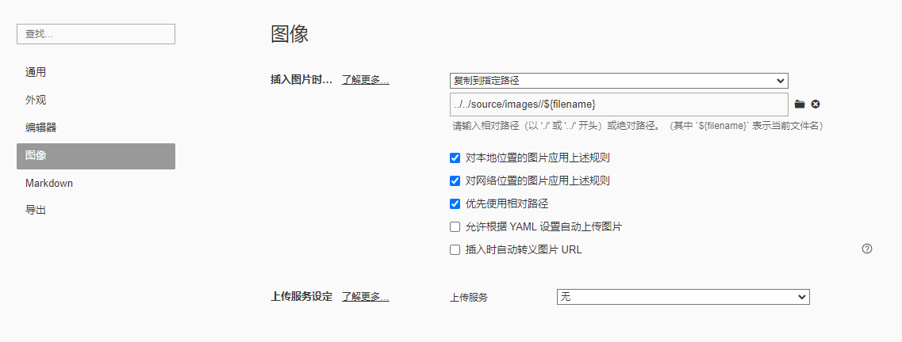

1. 安装插件

   ```shell
   $ npm install hexo-renderer-marked --save
   ```

2. 修改一下配置文件_config.yml，变为如下内容

   ```yaml
   marked:
     prependRoot: true
     postAsset: true
   ```

3. 在“Blog->source”下新建"imags"文件夹。注意"imags"与"_posts"同级。(此处Blog为你的hexo文件夹)

4. 在Typora中“文件->设置偏好->图像“。在插入图片时”复制到指定路径“设置为

   ```
   ../../source/images//${filename}
   ```

   也可以不做这步，自己每次手动复制也行，就是麻烦，当然别的工具也可以

   

5. 在”格式->图像->设置图片根目录“将"Blog->source"设置为根目录。

   我没有设置这一步，但是可以了，不行的话，设置和不设置都试试

6. 参考链接

   https://yinyoupoet.github.io/2019/09/03/hexo%E5%8D%9A%E5%AE%A2%E4%B8%AD%E6%8F%92%E5%85%A5%E5%9B%BE%E7%89%87/

   https://github.com/hexojs/hexo-renderer-marked


​	


